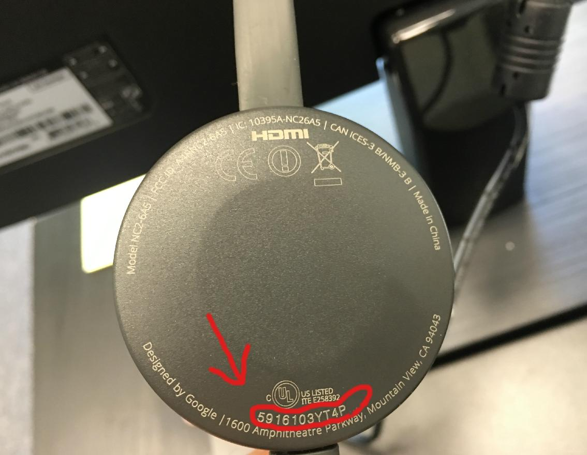
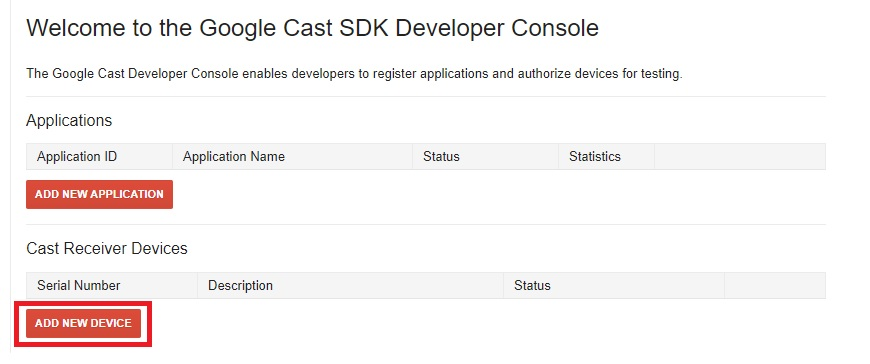
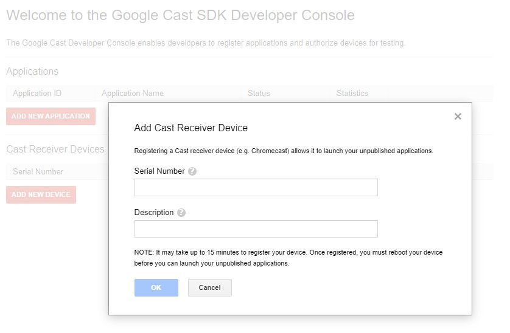
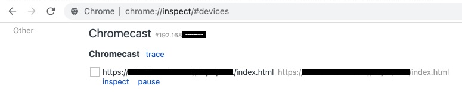

# Debugging chromecast application

## How to connect
1. Ensure that the Sender's device (laptop or mobile device) is connected to the same network as the Chromecast.
2. Add the serial number of your Chromecast device to the [Google Cast website](https://cast.google.com/publish) by navigating to *Google Cast SDK Developer Console → Overview → Cast Receiver Devices → Add New Device.* 

|  | 
|:--:| 
| *Serial number, more: https://stackoverflow.com/a/34094201* |
---
|  | 
|:--:| 
| *Add new device* |
----
|  | 
|:--:| 
| *Add cast receiver device* |
3. Cast your content to the Chromecast device.
4. Open the Chrome browser and enter the following URL: **chrome://inspect/#devices**:

|  | 
|:--:| 
| *Debugging app from via browser tools* |

## Troubleshooting

### For the Chromecast:

1. Ensure that your Chromecast is registered to your account at https://cast.google.com/publish/#/overview.
2. Take a second look at the serial number, as it may contain characters that look similar, such as O and 0, 1 and l, etc.
3. Once the device status shows as "Ready For Testing," perform a reboot.

### Regarding the app:

1. Ensure that the app is registered under the same account as the device.
2. If you don't have an app (for example, if you want to test casting directly from your website), you'll need to create one. You can opt for a "Styled Media Receiver" to avoid the need to host JavaScript externally. This option is essentially the same as the default receiver.
3. Confirm that your app is published. Once it is published, proceed to reboot the Chromecast.
4. Keep in mind that the app must be running before you can inspect it.

### Remote debug tool
To verify that the problem is not stemming from your website, you can employ https://casttool.appspot.com/cactool/ (please replace the appID with your own).

Commence the casting process and subsequently go to chrome://inspect/#devices. Here, you should ideally locate the "inspect" button for use.